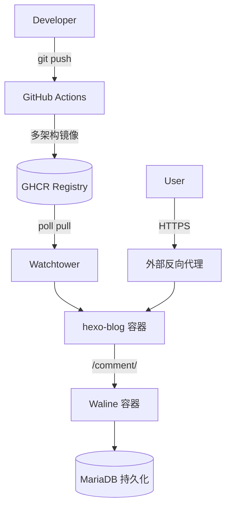

# 杨与S8的博客站

<p align="center">
	<a href="https://blog.yangyus8.top" target="_blank"></a>
	
	<a href="https://github.com/YangYuS8/blog/actions/workflows/docker-deploy.yml"></a>
	
	
	
</p>

> 基于 **Hexo 8 + Fluid 主题** 的静态博客，Docker 多阶段构建 & GHCR 镜像分发，Watchtower 自动拉取更新，Waline 评论同域反代 `/comment/`。页脚展示构建 commit 短哈希，支持一键备份与按 `abbrlink` 删除文章。

---

## 📑 目录 (Table of Contents)

- [特性概览](#-特性概览)
- [快速开始](#-快速开始)
- [架构示意](#-架构示意)
- [目录结构](#-目录结构)
- [部署（内网 Pull 模式）](#-部署内网-pull-模式)
- [自动更新机制](#-自动更新机制)
- [Waline 与数据库](#-waline-与数据库)
- [备份与恢复](#-备份与恢复)
- [运维常用命令](#-运维常用命令)
- [写作与发布流程](#-写作与发布流程)
- [按 abbrlink 删除文章](#-按-abbrlink-删除文章)
- [重置 / 清空操作](#-重置--清空操作)
- [安全与加固建议](#-安全与加固建议)
- [故障排查速查表](#-故障排查速查表)
- [Makefile 命令速览](#-makefile-命令速览)
- [License](#license)

---

## ✅ 特性概览

| 功能 | 说明 |
|------|------|
| 主题 | Fluid，自适应/TOC/深浅色自动 |
| 短链接 | `hexo-abbrlink` 稳定 `post/:abbrlink/` |
| 搜索 & 订阅 | 本地搜索 + `atom.xml` + `sitemap.xml` |
| Markdown 增强 | emoji / footnote / task list |
| 代码高亮 | Prism 预处理 + 复制按钮 |
| 内容统计 | 字数 & 阅读时长显示 |
| 压缩优化 | `hexo-neat` HTML/CSS/JS 压缩 |
| 评论 | Waline + MariaDB，反代 `/comment/` |
| 自动更新 | Actions 多架构构建 + Watchtower 拉取 |
| 构建信息 | 页脚展示构建短哈希 |
| 数据安全 | 一键备份脚本 + 保留最新 N 份 |
| 维护辅助 | 按 abbrlink 删除文章 / 重置站点 |

---

## 🚀 快速开始
```bash
git clone https://github.com/YangYuS8/blog.git /opt/hexo
cd /opt/hexo
cp .env.example .env   # 修改强随机密码
docker compose up -d
```
验证：
```bash
curl -I http://127.0.0.1/
curl -I http://127.0.0.1/comment/
```

写一篇文章：
```bash
pnpm install
make new t="第一篇文章"
make serve   # http://localhost:4000
git add source/_posts/*.md
git commit -m "feat(post): 第一篇文章"
git push     # 触发 CI 构建 & watchtower 自动更新
```

---

## 🧩 架构示意



---

## 📁 目录结构
```
Dockerfile                # 多阶段构建 (Node -> Nginx)
docker-compose.yml        # 生产编排
docker/nginx.conf         # Nginx + Waline 反代
.dockerignore             # 构建上下文精简
_config.yml               # Hexo 主配置
_config.fluid.yml         # 主题配置（含页脚短哈希 partial）
ops/backup-db.sh          # MariaDB 备份
ops/update.sh             # 手动更新镜像
Makefile                  # 常用命令
.env.example              # 环境变量模板
source/_posts/            # 文章目录
```

---

## 🛠 部署（内网 Pull 模式）
> 服务器已安装 Docker & Compose，外层代理暴露 80/443。

1. 克隆 & 准备 `.env`
2. `docker compose up -d`
3. 外层反向代理将域名指向该宿主机端口（或通过隧道）
4. 等待或强制更新：`make update-local`

关键变量（`.env`）：`MYSQL_ROOT_PASSWORD` / `MYSQL_PASSWORD` / `ADMIN_PASSWORD` / `WALINE_PUBLIC_URL`

---

## ♻️ 自动更新机制
| 组件 | 行为 |
|------|------|
| GitHub Actions | 监听内容/配置变动构建多架构镜像推送 GHCR |
| Watchtower | 每 1800s 检测 `ghcr.io/yangyus8/hexo-blog:latest` 更新 | 
| Blog 容器 | 有新镜像 → 自动替换运行 | 

手动立即更新：`make update-local`

---

## 💬 Waline 与数据库
同域子路径 `/comment/` 反代 Waline：减少跨域 & Cookie 复杂度。

服务组成：
| 服务 | 说明 |
|------|------|
| waline | 评论后端（读取 `.env` 中管理员等） |
| waline-db | MariaDB 11.4，utf8mb4，持久化卷 |
| blog | Nginx 静态站，内置反代 `/comment/` |

---

## 🧷 备份与恢复
创建备份：
```bash
make backup-db                 # -> backups/*.sql.gz
RETAIN=14 make backup-db       # 保留 14 份
```
恢复：
```bash
gunzip -c backups/waline-XXXX.sql.gz | docker exec -i waline-db sh -c 'mysql -uwaline -p"$MYSQL_PASSWORD" waline'
```
Cron 示例：`0 3 * * * /opt/hexo/ops/backup-db.sh >> /var/log/waline-backup.log 2>&1`

---

## 🔧 运维常用命令
```bash
make watchtower-logs   # 观察自动更新
make update-local      # 立即拉取最新镜像
make backup-db         # 手动备份
make prune             # 清理镜像缓存
docker compose ps
docker compose logs -f blog
```

---

## ✍️ 写作与发布流程
1. `make new t="标题"`
2. 编辑生成的 `source/_posts/标题.md`
3. `make serve` 预览
4. `git commit && git push`
5. 等待 watchtower 拉取（或 `make update-local`）

页脚短哈希写入：构建传入 `GIT_COMMIT` → 生成 `source/_includes/build_revision.ejs` → 主题 footer partial 引用。

---

## 🗑 按 abbrlink 删除文章
```bash
make delete-post abbr=4a17b156          # 仅提示 (保护)
make delete-post abbr=4a17b156 force=YES  # 真正删除
make clean && make build
```
匹配多个同 abbrlink 会中止，需手工处理冲突。

---

## 🔨 重置 / 清空操作
| 目标 | 删除 | 保留 | 用途 |
|------|------|------|------|
| reset-site | public/ db.json posts | 配置/依赖/主题 | 清空内容重写 |
| reset-all  | 同上并清空 posts | 配置/依赖/主题 | 交付干净骨架 |

执行：
```bash
make reset-site confirm=YES
make reset-all confirm=ALL
```

---

## 🔐 安全与加固建议
| 项目 | 建议 |
|------|------|
| 密码 | `.env` 内所有密码 ≥ 24 位随机字符 |
| DB 暴露 | 不映射 3306，仅内部网络访问 |
| 传输 | 外层强制 HTTPS + HSTS + HTTP/2 |
| 备份 | 定期异地存储备份归档 |
| 更新频率 | Watchtower 轮询可调大减少拉取频次 |
| 镜像 | 若需更小可自制 distroless Nginx 静态镜像 |

---

## 🩺 故障排查速查表
| 现象 | 排查 | 解决 |
|------|------|------|
| 页脚无 Build 哈希 | 查看 `public/index.html` | 确认 CI 传入 `GIT_COMMIT` 重新构建 |
| Waline 404/失败 | `curl /comment/` | 检查 Nginx 反代 + 容器状态 |
| 新文章未更新 | `docker logs watchtower` | 手动 `make update-local` |
| 备份为空 | 目录权限/脚本执行日志 | 确认容器名 & 权限 |
| COPY nginx.conf 失败 | `.dockerignore` 内容 | 移除对 `docker/` 的忽略 |

---

## 🧰 Makefile 命令速览
| 命令 | 说明 |
|------|------|
| `make new t="标题"` | 新文章 |
| `make serve` | 本地预览 |
| `make build` | 生成静态文件 |
| `make docker-build` | 本地构建镜像 |
| `make update-local` | 拉取最新镜像并重启 |
| `make backup-db` | MariaDB 备份 |
| `make watchtower-logs` | 自动更新日志 |
| `make reset-site confirm=YES` | 清空文章/生成产物 |
| `make reset-all confirm=ALL` | 重置为骨架 |
| `make delete-post abbr=XXXX force=YES` | 删除指定文章 |

---

## License
个人博客项目，未特别声明的代码与配置默认遵循其依赖原始协议；文章内容版权归作者所有，转载请注明出处。

---
欢迎 Issue / PR 反馈与改进。🚀