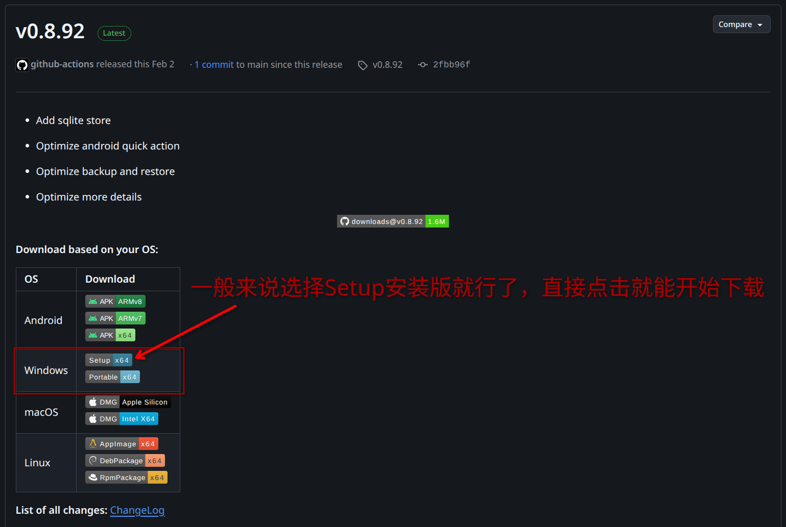
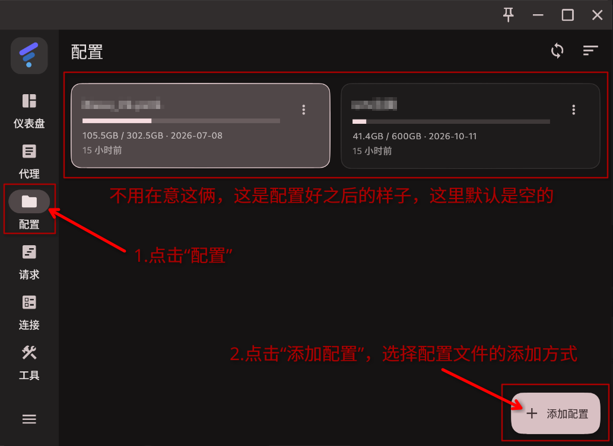
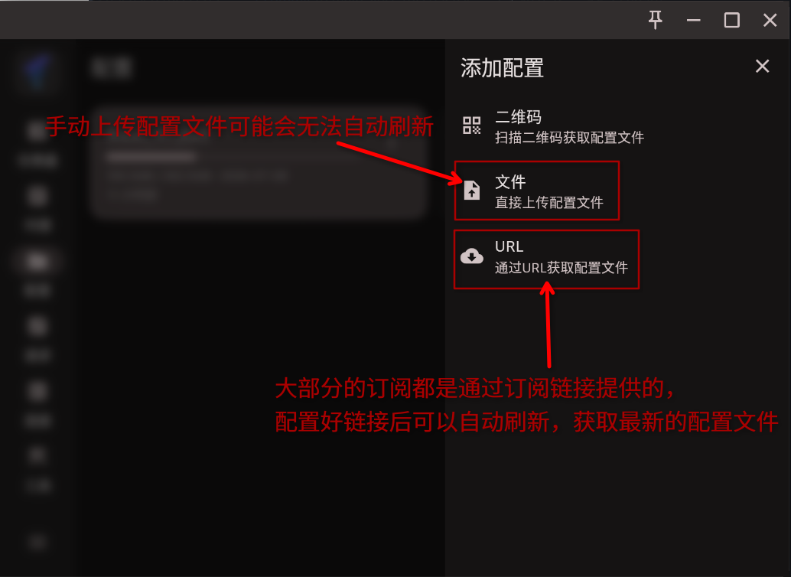
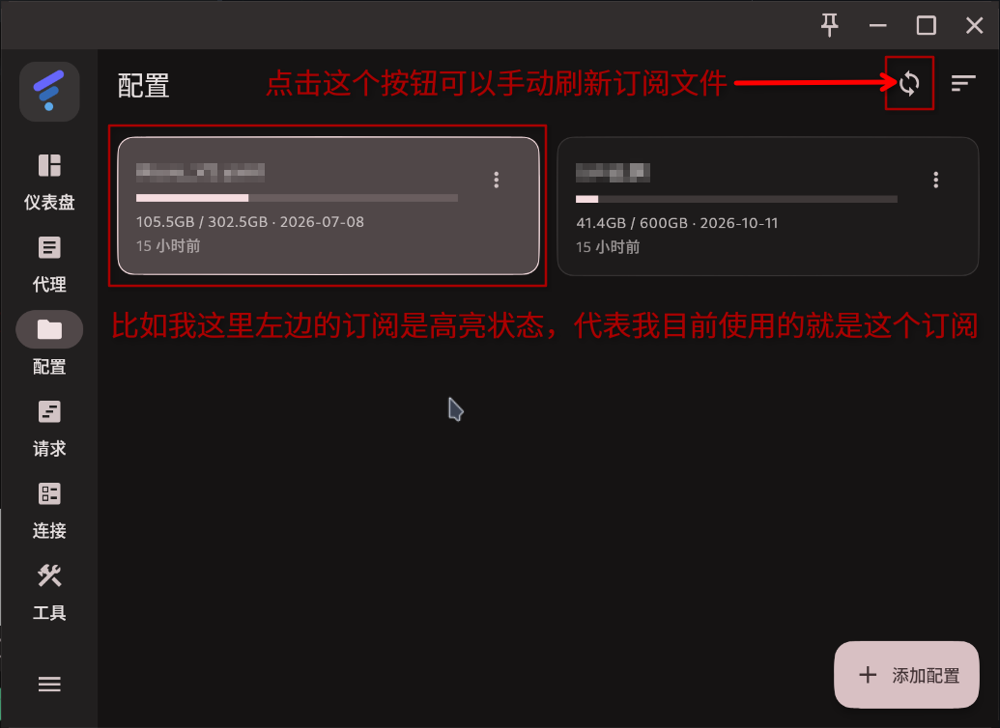
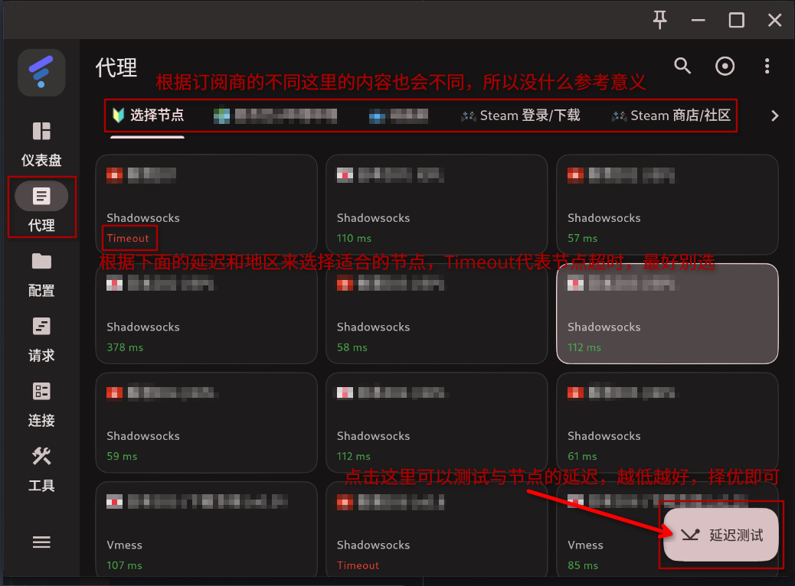
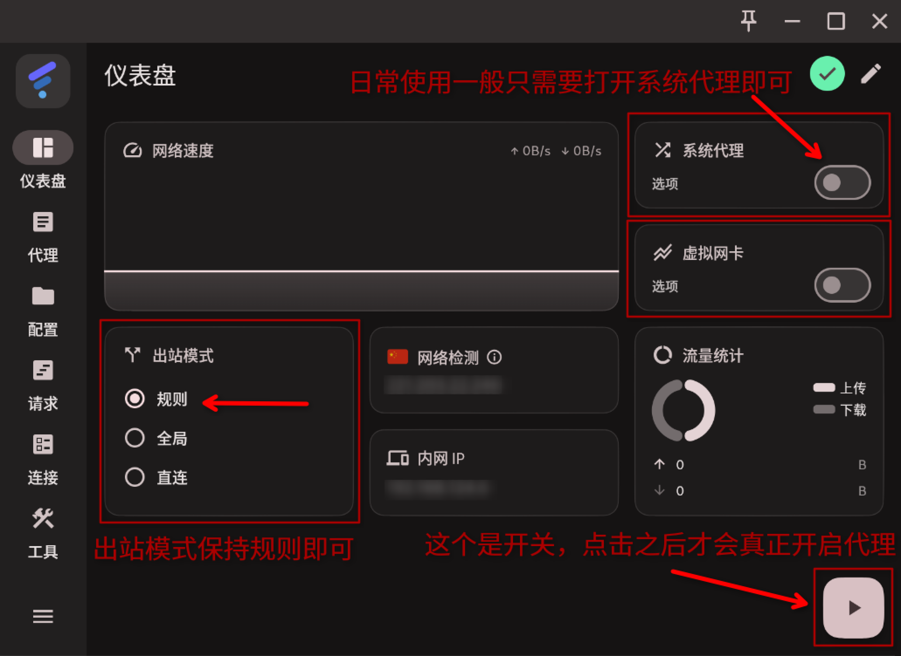
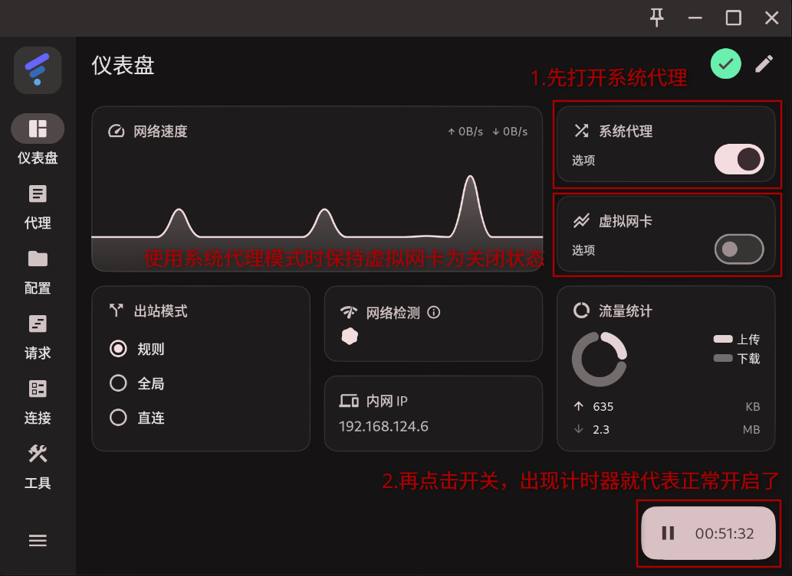
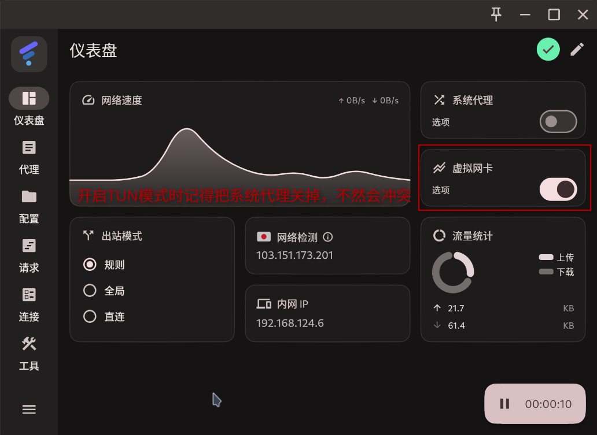
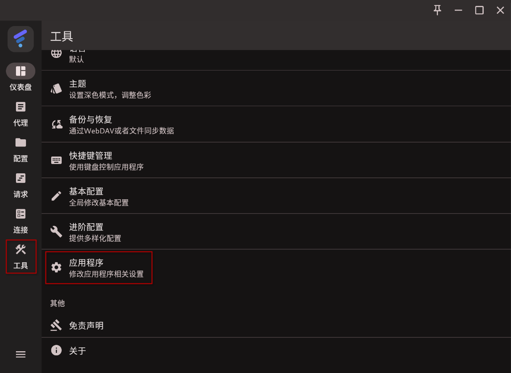
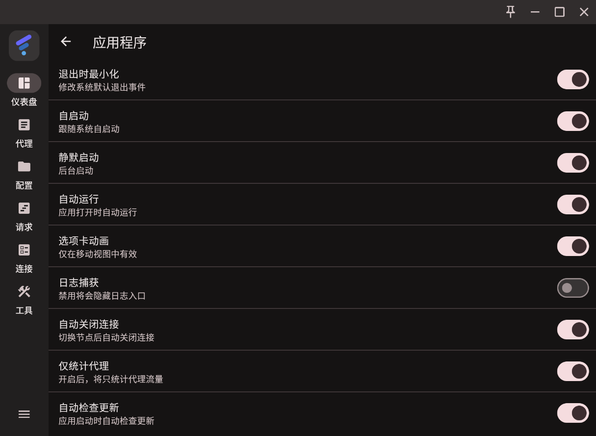

FlClash 是一个基于 ClashMeta / Mihomo 的图形客户端，支持 Windows、macOS、Linux 和 Android。

本文按 Windows 平台整理它的下载和基础使用流程。

## 下载前先准备什么

FlClash 只是客户端，不直接提供线路配置。你需要提前准备以下三项中的任意一项：

- 订阅链接
- 本地配置文件
- 二维码配置（如果服务方支持）

## 下载 FlClash

建议优先使用官方发布页：

- GitHub Releases 页面：`https://github.com/chen08209/FlClash/releases`

按这次整理时看到的信息，2026 年项目仍在更新，最近公开版本是 `v0.8.92`。

Windows 常见下载包有两个：

- `windows-amd64-setup.exe`：安装版
- `windows-amd64.zip`：便携版

当然，如果你没办法正常访问官方链接，也可以去官方的镜像地址下载安装包：[FlClash-0.8.91-windows-amd64-setup.exe](https://dl.p6p.net/FlClash/v0.8.91/FlClash-0.8.91-windows-amd64-setup.exe)

## 安装 FlClash

1. 双击运行安装包
2. 如果 Windows 提示“Windows 已保护你的电脑”，先点“更多信息”，再点“仍要运行”
3. 按默认选项完成安装
4. 启动 FlClash

## 配置订阅

### 导入订阅

第一次打开后，先点开配置页面，把你的配置文件/订阅链接导入进去：

### 切换与刷新订阅

如果你添加了多个订阅，可以通过点击来切换订阅；如果你使用URL添加订阅，可以用右上角的刷新按钮手动刷新订阅：

到这里就完成了订阅的导入和启用。

## 选择节点

### 在“代理”页面选择节点或策略组

导入配置不等于已经选好节点。正式使用前，最好先在代理页面确认当前策略组和节点。

## 打开系统代理

先回到仪表盘介绍一下：

很多第一次使用的人，问题不是出在导入配置，而是没有打开系统代理。

操作时重点检查三件事：

- FlClash 是否处于运行状态
- 系统代理开关是否已经打开
- 当前配置和节点是否已经启用

打开系统代理后，再去浏览器里测试。

## 什么时候需要开虚拟网卡（TUN）

TUN 不是第一步必须开启的功能。

可以先这样理解：

- 只需要浏览器和常规应用走代理时，先开系统代理通常就够了
- 某些应用不走系统代理，或者你需要更完整的流量接管时，再考虑 TUN

如果一开始就打开 TUN 后出现报错、权限问题或行为异常，先退回系统代理模式排查更稳。

## 怎么判断有没有配置成功

最简单的，打开浏览器看看能不能使用Google搜索引擎就行了

## 应用设置

如果你刚需开机自启、后台静默启动之类的功能，可以在工具->应用程序自行配置

我自己的设置如下，仅作参考，根据自身实际情况选择：

## 常见问题

### 软件装好了，但网页还是打不开

优先检查：

- 配置是否导入成功
- 当前配置是否启用
- 节点是否选中
- 系统代理是否打开

### 导入了订阅，但节点列表是空的

优先检查：

- 订阅链接是否过期
- 链接内容是否能正常拉取
- 配置格式是否兼容

### 一开 TUN 就报错

先按这个顺序排查：

- 先关闭 TUN
- 只测试系统代理模式
- 确认基础使用正常后，再单独排查 TUN

### 不知道该选安装版还是便携版

没有特殊需求时，先选安装版。

## 小结

这篇博客写的比较着急，有很多高级功能都没有讲到，不过对于日常使用来说应该是足够了，以后有空也许会补充附加规则、脚本覆盖之类的高级操作。
